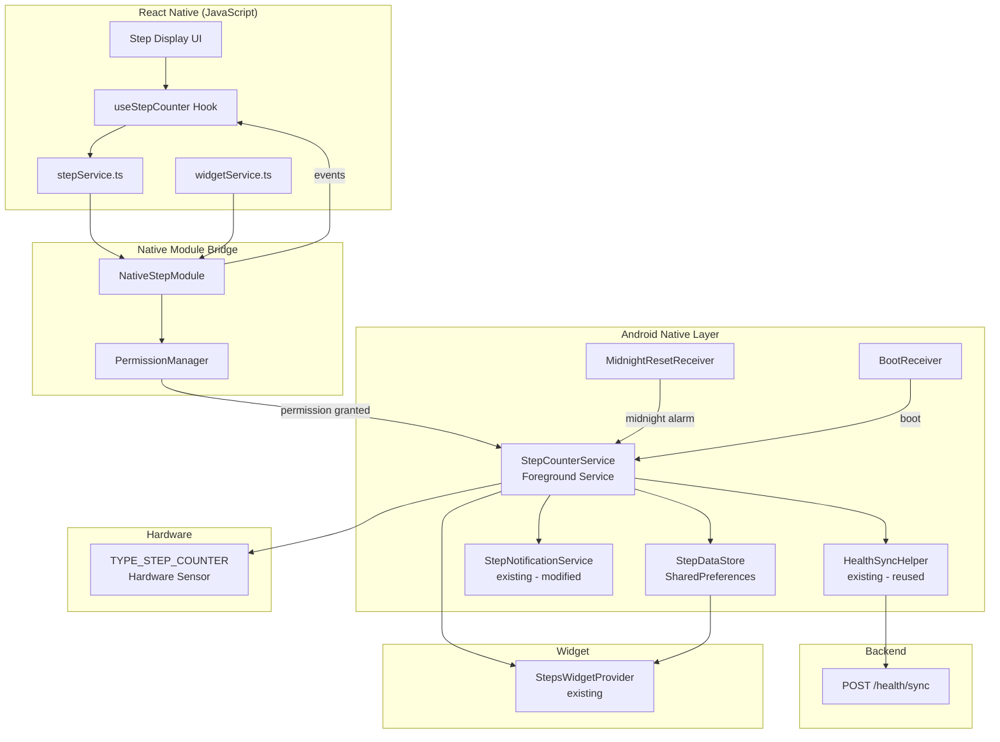
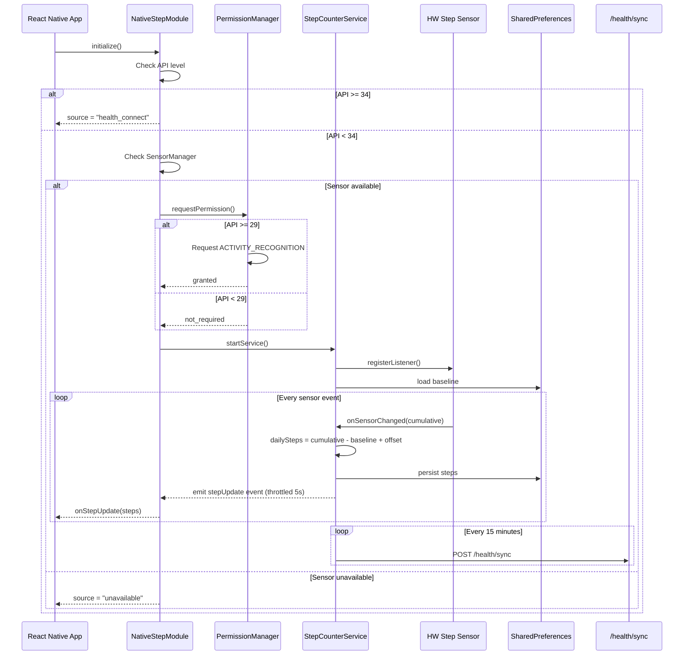
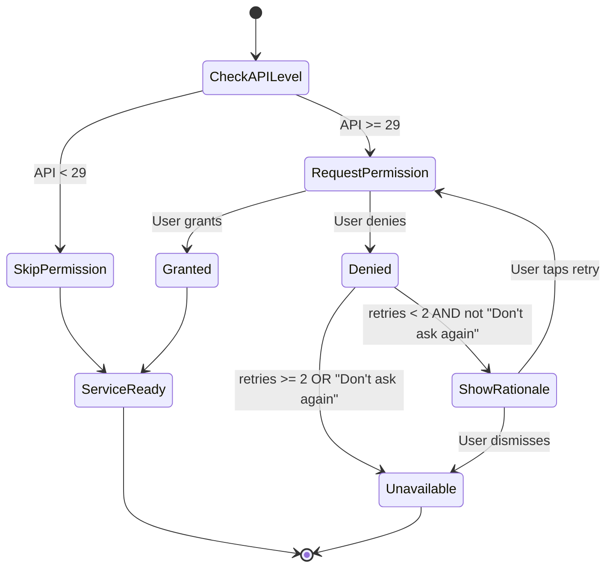

# Design Document: Built-in Step Counter

## Overview

This feature introduces a native hardware step counter for Athlofit on pre-Android 14 (API < 34) devices, eliminating the dependency on Health Connect for step counting. The system reads directly from the device's `TYPE_STEP_COUNTER` hardware sensor via an Android foreground service, bridges the data to React Native through a native module, and integrates with the existing health sync pipeline.

**Key Design Decisions:**

1. **Foreground Service over WorkManager** — Step counting requires continuous sensor registration. A foreground service with a persistent notification is the only reliable way to maintain sensor access across Doze mode and app kills.
2. **SharedPreferences as Step_Data_Store** — Lightweight, synchronous, and already used by the existing `StepsWidgetProvider`. No new storage dependency needed.
3. **Reuse existing HealthSyncHelper.postSync()** — The native step counter produces the same JSON payload as the Health Connect path, so the backend requires zero changes.
4. **API level 34 as the cutoff** — Android 14 (API 34) ships Health Connect as a platform component. Below that, the native sensor is more reliable than requiring users to install a separate APK.

## Architecture



### Component Interaction Flow



## Components and Interfaces

### 1. NativeStepModule (React Native Bridge)

**Location:** `android/app/src/main/java/com/athlofit/NativeStepModule.kt`

Extends `ReactContextBaseJavaModule`. Registered as `"NativeStep"` in the React Native module registry.

```kotlin
// Public API exposed to JavaScript
interface NativeStepModuleAPI {
    // Lifecycle
    fun start(): Promise<Boolean>          // Start step counting
    fun stop(): Promise<Boolean>           // Stop step counting

    // Queries
    fun getCurrentSteps(): Promise<Int>    // Current daily step count
    fun isSensorAvailable(): Promise<Boolean>
    fun getPermissionStatus(): Promise<String>  // "granted" | "denied" | "not_required"
    fun getActiveSource(): Promise<String>      // "health_connect" | "native_sensor" | "unavailable"

    // Events emitted to JS
    // "onStepUpdate" → { steps: number }
    // "onServiceStopped" → {}
    // "onSensorUnavailable" → {}
}
```

### 2. NativeStepPackage

**Location:** `android/app/src/main/java/com/athlofit/NativeStepPackage.kt`

Standard `ReactPackage` implementation that registers `NativeStepModule` with the React Native bridge. Added to `MainApplication.kt`'s `getPackages()` list.

### 3. StepCounterService (Foreground Service)

**Location:** `android/app/src/main/java/com/athlofit/StepCounterService.kt`

Core service that owns the sensor listener and manages step accumulation.

```kotlin
class StepCounterService : Service(), SensorEventListener {
    // State
    private var baseline: Long = 0          // Sensor value at start of day
    private var dailySteps: Int = 0         // Accumulated steps today
    private var rebootOffset: Int = 0       // Steps before last reboot
    private var storedDate: String = ""     // YYYY-MM-DD of current tracking day
    private var lastPersistTime: Long = 0   // Timestamp of last SharedPrefs write
    private var lastSyncTime: Long = 0      // Timestamp of last network sync
    private var lastEventEmitTime: Long = 0 // Timestamp of last JS event emission

    // Sensor callback
    override fun onSensorChanged(event: SensorEvent) {
        val cumulative = event.values[0].toLong()
        if (cumulative <= baseline) {
            // Reboot detected
            rebootOffset += dailySteps
            baseline = cumulative
            dailySteps = 0
        }
        dailySteps = (cumulative - baseline).toInt() + rebootOffset
        maybePersist()
        maybeEmitEvent()
        maybeUpdateNotification()
    }

    // Persistence (max every 90s)
    private fun maybePersist() { ... }

    // Network sync (max every 15min)
    private fun maybeSync() { ... }

    // Midnight reset
    private fun performMidnightReset() { ... }
}
```

### 4. PermissionManager

**Location:** `android/app/src/main/java/com/athlofit/StepPermissionManager.kt`

Handles ACTIVITY_RECOGNITION permission flow with retry logic.

```kotlin
object StepPermissionManager {
    private var retryCount: Int = 0
    private const val MAX_RETRIES = 2

    fun needsPermission(): Boolean = Build.VERSION.SDK_INT >= Build.VERSION_CODES.Q

    fun requestPermission(activity: Activity, callback: (Boolean) -> Unit)

    fun isGranted(context: Context): Boolean

    fun getStatus(context: Context): String  // "granted" | "denied" | "not_required"
}
```

### 5. MidnightResetReceiver

**Location:** `android/app/src/main/java/com/athlofit/MidnightResetReceiver.kt`

BroadcastReceiver triggered by AlarmManager at midnight. If `StepCounterService` is not running, starts it (which triggers date-change detection and reset).

### 6. StepSourceResolver

**Location:** `android/app/src/main/java/com/athlofit/StepSourceResolver.kt`

Pure function that determines the step data source based on device capabilities.

```kotlin
object StepSourceResolver {
    enum class Source { HEALTH_CONNECT, NATIVE_SENSOR, UNAVAILABLE }

    fun resolve(context: Context): Source {
        if (Build.VERSION.SDK_INT >= 34) return Source.HEALTH_CONNECT
        val sensorManager = context.getSystemService(Context.SENSOR_SERVICE) as? SensorManager
            ?: return Source.UNAVAILABLE
        val stepSensor = sensorManager.getDefaultSensor(Sensor.TYPE_STEP_COUNTER)
            ?: return Source.UNAVAILABLE
        return Source.NATIVE_SENSOR
    }
}
```

### 7. JavaScript Layer (React Native)

**New file:** `src/services/stepService.ts`

```typescript
interface StepServiceAPI {
  initialize(): Promise<StepSource>;
  start(): Promise<boolean>;
  stop(): Promise<boolean>;
  getCurrentSteps(): Promise<number>;
  onStepUpdate(callback: (steps: number) => void): () => void;  // returns unsubscribe
  getSource(): StepSource;
}

type StepSource = 'health_connect' | 'native_sensor' | 'unavailable';
```

### Modified Existing Components

| Component | Modification |
|-----------|-------------|
| `BootReceiver.kt` | Add `StepCounterService.start(context)` call when source is native |
| `StepNotificationService.kt` | Read from `StepDataStore` when source is native instead of Health Connect |
| `AndroidManifest.xml` | Add `ACTIVITY_RECOGNITION` permission, `FOREGROUND_SERVICE_HEALTH` type, `StepCounterService` declaration, `MidnightResetReceiver` declaration |
| `MainApplication.kt` | Register `NativeStepPackage` |
| `widgetService.ts` | Add `stepService` integration for native source |

## Data Models

### StepDataStore (SharedPreferences file: "StepCounterPrefs")

| Key | Type | Description |
|-----|------|-------------|
| `baseline` | Long | Cumulative sensor value at start of current day |
| `dailySteps` | Int | Current day's accumulated step count |
| `rebootOffset` | Int | Steps accumulated before last detected reboot |
| `storedDate` | String | Date (YYYY-MM-DD) of the current tracking day |
| `lastSyncTime` | Long | Epoch millis of last successful backend sync |
| `pendingSyncPayload` | String (JSON) | Unsent sync payload retained after failure |

### Widget SharedPreferences (file: "StepsWidgetPrefs") — existing, reused

| Key | Type | Description |
|-----|------|-------------|
| `steps` | Int | Current daily step count (written by StepCounterService) |
| `goal` | Int | Daily step goal |
| `lastUpdated` | Long | Epoch millis of last step count change |
| `accessToken` | String | Bearer token for backend sync |
| `weightKg` | Float | User weight for calorie derivation |

### Health Sync Payload (JSON → POST /health/sync)

```json
{
  "date": "2025-01-15",
  "steps": 8432,
  "calories": 336,
  "distance": 6.41,
  "activeMinutes": 84,
  "goalMet": false
}
```

**Derivation formulas:**
- `calories = floor(steps × (weightKg × 0.57) / 1000)`
- `distance = round(steps × 0.76 / 1000, 2)`
- `activeMinutes = floor(steps / 100)`
- `goalMet = steps >= dailyStepGoal`

### Step Source Resolution Truth Table

| API Level | Sensor Present | Health Connect Available | Source |
|-----------|---------------|------------------------|--------|
| ≥ 34 | any | yes | `health_connect` |
| ≥ 34 | any | no | `unavailable` |
| < 34 | yes | any | `native_sensor` |
| < 34 | no | any | `unavailable` |

### Permission Flow State Machine



## Correctness Properties

*A property is a characteristic or behavior that should hold true across all valid executions of a system — essentially, a formal statement about what the system should do. Properties serve as the bridge between human-readable specifications and machine-verifiable correctness guarantees.*

### Property 1: Step Source Selection

*For any* combination of Android API level, hardware sensor availability, and Health Connect availability, the `StepSourceResolver.resolve()` function SHALL return the correct source: `HEALTH_CONNECT` when API ≥ 34 and HC is available, `NATIVE_SENSOR` when API < 34 and sensor is present, or `UNAVAILABLE` otherwise.

**Validates: Requirements 1.1, 1.3, 1.4, 7.1, 7.2, 7.5**

### Property 2: Permission Gating

*For any* Android API level and permission state, the system SHALL only register a sensor listener when either (a) the API level is below 29, or (b) the ACTIVITY_RECOGNITION permission is granted. No sensor registration SHALL occur when API ≥ 29 and permission is not granted.

**Validates: Requirements 2.1, 2.6, 2.7**

### Property 3: Permission Retry Bounds

*For any* sequence of permission denial events within a single app session, the number of retry prompts shown to the user SHALL never exceed 2.

**Validates: Requirements 2.3**

### Property 4: Step Calculation Correctness

*For any* sequence of sensor events (including reboots where the cumulative value resets to a lower number), the computed daily step count SHALL equal the sum of all steps actually taken since midnight, calculated as: `(current_cumulative - baseline) + reboot_offset`, where `reboot_offset` accumulates the pre-reboot daily steps on each detected reboot.

**Validates: Requirements 3.4, 3.5, 3.6**

### Property 5: Midnight Reset State Transition

*For any* pre-reset state consisting of (dailySteps, rebootOffset, baseline, storedDate, currentSensorValue), performing a midnight reset SHALL produce a post-state where: dailySteps = 0, rebootOffset = 0, baseline = currentSensorValue, storedDate = today's date, and the previous day's total (dailySteps + rebootOffset) is persisted with the previous date.

**Validates: Requirements 4.1, 4.2**

### Property 6: Multi-Day Gap Filling

*For any* gap of N calendar days between the stored date and the current date (where N > 1), the system SHALL persist exactly one record for the stored date (with its accumulated steps) and N-1 records for intermediate dates (each with zero steps), then reset for the current day.

**Validates: Requirements 4.3**

### Property 7: Event Emission Throttling

*For any* sequence of step count changes occurring within a time window, the number of events emitted to the JavaScript layer SHALL not exceed one per 5-second interval. Formally: for any two consecutive emitted events, the time difference between them SHALL be ≥ 5 seconds.

**Validates: Requirements 5.5**

### Property 8: Derived Metrics Calculation

*For any* step count (non-negative integer) and weight (positive float, defaulting to 70.0 if unavailable), the sync payload SHALL contain: `calories = floor(steps × weightKg × 0.57 / 1000)`, `distance = round(steps × 0.76 / 1000, 2)`, and `activeMinutes = floor(steps / 100)`.

**Validates: Requirements 6.1, 6.4, 6.5, 6.6, 6.7**

### Property 9: Sync Data Retention on Failure

*For any* failed sync attempt (network error or non-2xx response), the pending sync payload SHALL be retained in `StepDataStore` and SHALL be available for the next sync cycle. No step data SHALL be discarded due to transient network failures.

**Validates: Requirements 6.3**

### Property 10: Network Sync Rate Limiting

*For any* sequence of sync trigger events, the system SHALL not perform network POST operations more frequently than once every 15 minutes. Formally: for any two consecutive successful or attempted POST calls, the time difference SHALL be ≥ 15 minutes.

**Validates: Requirements 9.4**

## Error Handling

| Error Condition | Handling Strategy | User Impact |
|----------------|-------------------|-------------|
| SensorManager is null | Emit `onSensorUnavailable`, report source as `unavailable` | User sees "step counting unavailable" message |
| TYPE_STEP_COUNTER not present | Same as above | Same as above |
| Sensor listener registration fails | Stop service, emit error to JS, log | User sees error, can retry |
| ACTIVITY_RECOGNITION denied permanently | Direct user to Settings, report unavailable | User must manually enable in Settings |
| Permission request system failure | Report unavailable, log error | User sees error message |
| Network sync fails (timeout/non-2xx) | Retain payload, retry next cycle (15 min) | No user impact — data syncs later |
| Device reboot (sensor value resets) | Detect via `cumulative <= baseline`, preserve offset | Seamless — no step loss |
| Service killed by system | `START_STICKY` ensures restart; persisted state survives | Brief gap, auto-recovers |
| SharedPreferences write failure | Catch exception, retry on next persist cycle | Minimal — 90s max data loss |
| Widget broadcast failure | Swallow error, continue service | Widget may show stale data briefly |
| Health Connect unavailable on API ≥ 34 | Report source as `unavailable` | User informed HC is needed |
| AlarmManager exact alarm not permitted (API 31+) | Fall back to `setAndAllowWhileIdle` | Midnight reset may be slightly delayed |

### Graceful Degradation Priority

1. **Step counting accuracy** — Never lose steps. Persist frequently, handle reboots.
2. **Backend sync** — Retry on failure, never discard data.
3. **Notification freshness** — Best-effort within 60s; stale data is acceptable.
4. **Widget freshness** — Best-effort; broadcast failure is non-fatal.

## Testing Strategy

### Unit Tests (Example-Based)

Focus on specific scenarios and edge cases:

- Service start/stop lifecycle (Promise resolution/rejection)
- Permission flow: grant → service starts, deny → rationale shown
- Notification content formatting (thousands separators, percentage)
- Boot receiver triggers service restart
- Sensor unavailability event emission
- Cached step display on service start before first sensor event

### Property-Based Tests

**Library:** [fast-check](https://github.com/dubzzz/fast-check) (for TypeScript/JavaScript logic) and custom JUnit5 + [jqwik](https://jqwik.net/) (for Kotlin/Android logic)

**Configuration:** Minimum 100 iterations per property test.

Each property test references its design document property:

| Property | Test Target | Generator Strategy |
|----------|-------------|-------------------|
| Property 1: Step Source Selection | `StepSourceResolver.resolve()` | Random (apiLevel: 19-35, sensorPresent: bool, hcAvailable: bool) |
| Property 2: Permission Gating | `NativeStepModule` initialization logic | Random (apiLevel: 19-35, permissionState: granted/denied/not_required) |
| Property 3: Permission Retry Bounds | `StepPermissionManager` retry counter | Random sequences of denial events (length 1-10) |
| Property 4: Step Calculation | `StepCounterService.onSensorChanged()` | Random sequences of sensor events including reboot scenarios |
| Property 5: Midnight Reset | `StepCounterService.performMidnightReset()` | Random pre-states (dailySteps: 0-50000, offset: 0-10000, baseline: 0-MAX_LONG) |
| Property 6: Multi-Day Gap | Gap-filling logic | Random gaps (2-30 days) with random stored step counts |
| Property 7: Event Throttling | Event emission logic | Random sequences of step changes with timestamps |
| Property 8: Derived Metrics | Calorie/distance/activeMinutes formulas | Random (steps: 0-100000, weight: 30.0-200.0) |
| Property 9: Sync Retention | Sync retry logic | Random failure/success sequences |
| Property 10: Network Rate Limit | Sync scheduling logic | Random trigger event sequences with timestamps |

**Tag format:** `Feature: built-in-step-counter, Property {N}: {title}`

### Integration Tests

- End-to-end: sensor event → step count update → notification update → widget update
- Background sync: service → POST /health/sync → backend response handling
- Boot recovery: simulate reboot → verify service restart and state recovery
- AlarmManager midnight reset: verify alarm scheduling and firing
- Doze mode: verify step accumulation continues (requires real device)

### Manual Testing Checklist

- Verify on API 28 device (no permission needed)
- Verify on API 29-33 device (permission flow)
- Verify on API 34+ device (Health Connect path, native service NOT started)
- Verify device without step sensor (graceful unavailable message)
- Verify overnight: midnight reset produces correct next-day count
- Verify reboot: steps preserved across device restart
- Verify battery: monitor battery drain over 24h with service running
- Verify widget consistency: widget matches app UI
