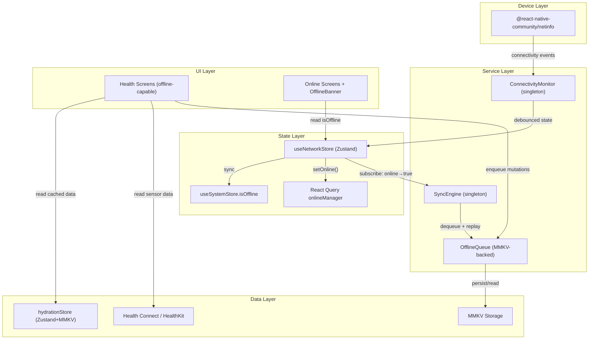

# Design Document: Offline Mode

## Overview

The Offline Mode feature provides seamless offline-first behavior for Athlofit's health tracking screens while gracefully degrading non-health screens with a connectivity banner. The architecture leverages the existing MMKV persistence layer and Zustand stores, adding a Connectivity Monitor (via `@react-native-community/netinfo`), an MMKV-backed Offline Queue, and a singleton Sync Engine that drains queued mutations on reconnection.

Key design decisions:
- **NetInfo + Zustand**: `@react-native-community/netinfo` (already installed) provides connectivity events; a dedicated `useNetworkStore` exposes reactive state to all components.
- **Debounce at the monitor level**: A 3-second stabilization window prevents rapid state flapping from triggering cascading UI updates or premature sync attempts.
- **MMKV for queue persistence**: Reuses the existing `mmkv` instance from `src/store/index.ts` — no new storage dependencies.
- **Singleton Sync Engine (non-React)**: A plain TypeScript class with mutex semantics, invoked reactively from a Zustand subscription — not a React component. This ensures sync works even when no component is mounted.
- **React Query `onlineManager` integration**: Pauses queries automatically when offline, preventing unnecessary network errors and retries.
- **Existing `useSystemStore.isOffline`**: The new `useNetworkStore` becomes the source of truth and drives `useSystemStore.setOffline()` for backward compatibility.

## Architecture



## Components and Interfaces

### 1. ConnectivityMonitor (`src/services/connectivityMonitor.ts`)

A singleton service that wraps NetInfo, applies debounce logic, and updates the network store.

```typescript
interface ConnectivityMonitor {
  /** Initialize the monitor — call once at app startup before navigation renders */
  initialize(): Promise<void>;

  /** Tear down listener (call on app unmount / test cleanup) */
  destroy(): void;
}
```

**Behavior:**
- On `initialize()`: calls `NetInfo.fetch()` to get initial state, sets store, then subscribes to `NetInfo.addEventListener`.
- Applies a 3-second debounce window: buffers rapid state changes and only commits the final stable value.
- Maps `null` / `unknown` connectivity to `offline` (fail-safe).
- Calls `useNetworkStore.getState().setOnline(value)` with the debounced result.
- Integrates with React Query's `onlineManager.setOnline(value)`.

### 2. useNetworkStore (`src/store/networkStore.ts`)

A Zustand store exposing reactive connectivity state.

```typescript
interface NetworkState {
  isOnline: boolean;
  lastChangedAt: number | null; // epoch ms of last confirmed transition

  // Actions
  setOnline: (online: boolean) => void;
}
```

**Behavior:**
- `setOnline(online)`: Updates `isOnline` only if the value differs from current (deduplication). Updates `lastChangedAt`. Also calls `useSystemStore.getState().setOffline(!online)` for backward compatibility.
- No MMKV persistence needed — state is derived from NetInfo on each app launch.

### 3. OfflineQueue (`src/services/offlineQueue.ts`)

An MMKV-backed FIFO queue for storing offline mutations.

```typescript
interface QueueEntry {
  id: string;                  // unique ID (uuid or timestamp-based)
  endpoint: string;            // e.g. "health/sync"
  method: 'POST' | 'PUT' | 'PATCH' | 'DELETE';
  payload: Record<string, unknown>;
  timestamp: string;           // ISO 8601
  actionType: 'hydration_sync' | 'health_sync' | 'general';
}

interface DeadLetterEntry {
  originalEntry: QueueEntry;
  failedAt: string;            // ISO 8601
  statusCode: number;
  errorMessage: string;
}

interface OfflineQueue {
  /** Add an action to the queue. Enforces 500-entry cap. */
  enqueue(entry: Omit<QueueEntry, 'id'>): QueueEntry;

  /** Retrieve all entries in chronological order (oldest first) */
  getAll(): QueueEntry[];

  /** Remove a specific entry by ID after successful sync */
  remove(id: string): void;

  /** Get current queue size */
  size(): number;

  /** Move an entry to the dead-letter section */
  moveToDeadLetter(entry: QueueEntry, statusCode: number, errorMessage: string): void;

  /** Get dead-letter entries */
  getDeadLetterEntries(): DeadLetterEntry[];

  /** Clear the entire queue (for testing / logout) */
  clear(): void;
}
```

**Storage keys:**
- `offline-queue:entries` — JSON array of `QueueEntry[]`
- `offline-queue:dead-letter` — JSON array of `DeadLetterEntry[]` (max 50)

**Invariants:**
- Queue never exceeds 500 entries (oldest discarded on overflow).
- Dead-letter never exceeds 50 entries (oldest discarded on overflow).
- Entries are always stored sorted by `timestamp` ascending.
- On MMKV write failure: retry once, then hold in memory for current session.

### 4. SyncEngine (`src/services/syncEngine.ts`)

A singleton service that drains the OfflineQueue when connectivity is restored.

```typescript
interface SyncEngine {
  /** Attempt to drain the queue. No-op if already running or offline. */
  drain(): Promise<void>;

  /** Whether a drain is currently in progress */
  readonly isProcessing: boolean;

  /** Subscribe to drain completion events */
  onDrainComplete(callback: () => void): () => void;
}
```

**Behavior:**
- **Mutex**: Uses a boolean lock (`isProcessing`). If `drain()` is called while already processing, it returns immediately (prevents concurrent drains from multiple connectivity events).
- **Batch cap**: Processes a maximum of 100 entries per drain session.
- **Order**: Processes entries oldest-first (chronological).
- **Retry logic (5xx)**: Up to 3 retries with exponential backoff (2s, 4s, 8s).
- **Client error (4xx)**: Immediately moves to dead-letter, continues with next entry.
- **Offline mid-drain**: Checks `useNetworkStore.getState().isOnline` before each request. If offline, halts and preserves remaining entries in their original order.
- **Post-drain**: Invalidates React Query caches (`weekly-steps`, `streaks`, `coin-data`, `gamification`, `challenges`, `hydration`).
- **Trigger**: A Zustand subscription on `useNetworkStore` fires `drain()` when `isOnline` transitions from `false` to `true`.

### 5. OfflineBanner (`src/components/OfflineBanner.tsx`)

A presentational component that renders a connectivity warning banner.

```typescript
interface OfflineBannerProps {
  // No props needed — reads from useNetworkStore internally
}
```

**Behavior:**
- Reads `isOnline` from `useNetworkStore`.
- When `!isOnline`: renders a banner with Wi-Fi-off icon (24×24 dp minimum) and text "No internet connection".
- Positioned at the top of the content area (below navigation header).
- Uses `Animated` opacity/height for smooth show/hide transitions.
- Does not obstruct scrolling — uses a fixed-height container that pushes content down.
- Themed via `useTheme()` hook (respects dark/light mode).

### 6. Integration Points

#### Hydration Store Integration

The existing `hydrationStore.addWater()` method is modified:
- **Online path** (unchanged): Optimistic update → POST to server → confirm or rollback.
- **Offline path** (new): Optimistic update → enqueue to OfflineQueue → no rollback (queue handles eventual sync).

```typescript
// Inside addWater():
const { isOnline } = useNetworkStore.getState();
if (!isOnline) {
  // Enqueue for later sync instead of calling server
  offlineQueue.enqueue({
    endpoint: 'health/sync',
    method: 'POST',
    payload: { hydration: { amount, timestamp: new Date().toISOString(), dailyTotal: newTotal } },
    timestamp: new Date().toISOString(),
    actionType: 'hydration_sync',
  });
  return; // Skip server call, keep optimistic state
}
```

#### Background Sync Integration

The existing `backgroundSync.service.ts` `postSync()` function is modified:
- Before calling `fetch()`, check `useNetworkStore.getState().isOnline`.
- If offline: enqueue the sync payload to `OfflineQueue` instead of attempting the network call.
- Suppress error notifications when offline.

#### React Query Integration

In `App.tsx` during QueryClient setup:
```typescript
import { onlineManager } from '@tanstack/react-query';
// ConnectivityMonitor already calls onlineManager.setOnline() on state changes
```

This automatically pauses queries when offline and resumes them on reconnection.

## Data Models

### QueueEntry (persisted in MMKV)

| Field       | Type     | Description                                    |
|-------------|----------|------------------------------------------------|
| id          | string   | Unique identifier (e.g., `queue_${Date.now()}`) |
| endpoint    | string   | API endpoint path (e.g., `health/sync`)        |
| method      | string   | HTTP method: POST, PUT, PATCH, DELETE          |
| payload     | object   | Request body to replay                         |
| timestamp   | string   | ISO 8601 creation time                         |
| actionType  | string   | Category: hydration_sync, health_sync, general |

### DeadLetterEntry (persisted in MMKV)

| Field         | Type        | Description                          |
|---------------|-------------|--------------------------------------|
| originalEntry | QueueEntry  | The failed queue entry                |
| failedAt      | string      | ISO 8601 time of final failure       |
| statusCode    | number      | HTTP status code that caused failure  |
| errorMessage  | string      | Error message from server            |

### NetworkState (Zustand, in-memory only)

| Field         | Type          | Description                              |
|---------------|---------------|------------------------------------------|
| isOnline      | boolean       | Current connectivity state               |
| lastChangedAt | number\|null  | Epoch ms of last confirmed transition    |

## Correctness Properties

*A property is a characteristic or behavior that should hold true across all valid executions of a system — essentially, a formal statement about what the system should do. Properties serve as the bridge between human-readable specifications and machine-verifiable correctness guarantees.*

### Property 1: Debounce stabilization produces final state

*For any* sequence of connectivity change events occurring within a 3-second window, the ConnectivityMonitor SHALL apply only the final event's state to the store after the stabilization period elapses, regardless of the number or order of intermediate events.

**Validates: Requirements 1.6, 1.7**

### Property 2: Queue entry persistence round-trip

*For any* valid queue entry (with endpoint, method, payload, timestamp, and actionType), enqueueing it to the OfflineQueue and then reading all entries from MMKV storage SHALL return an entry with identical field values.

**Validates: Requirements 3.3, 3.5**

### Property 3: Queue chronological ordering invariant

*For any* set of queue entries with distinct timestamps inserted in any order, retrieving all entries from the OfflineQueue SHALL always return them sorted by timestamp in ascending (oldest-first) order.

**Validates: Requirements 3.2, 7.4**

### Property 4: Queue size cap invariant

*For any* sequence of enqueue operations, the OfflineQueue size SHALL never exceed 500 entries. When an enqueue would cause overflow, the oldest entries are discarded first.

**Validates: Requirements 3.4**

### Property 5: Sync engine ordered drain with batch cap

*For any* queue of N entries (where N > 0), the SyncEngine SHALL process entries in chronological order and stop after processing min(N, 100) entries per drain session, leaving remaining entries in the queue.

**Validates: Requirements 4.2**

### Property 6: Error classification and dead-letter management

*For any* queued action that receives a 4xx client error response, the SyncEngine SHALL move it to the dead-letter section. The dead-letter section SHALL never exceed 50 entries, discarding the oldest when full.

**Validates: Requirements 4.4, 4.5**

### Property 7: Sync mutex prevents concurrent execution

*For any* number of concurrent `drain()` invocations, at most one drain operation SHALL execute at any given time. Additional invocations SHALL return immediately without processing.

**Validates: Requirements 4.7**

### Property 8: Mid-drain offline halts and preserves remaining

*For any* queue being drained, if the device transitions to offline during processing, the SyncEngine SHALL halt and all unprocessed entries SHALL remain in the queue in their original chronological order.

**Validates: Requirements 4.8**

### Property 9: Successful sync removes entry from queue

*For any* queue entry that is successfully replayed (2xx response), the entry SHALL be removed from the OfflineQueue and SHALL not appear in subsequent `getAll()` calls.

**Validates: Requirements 6.4**

### Property 10: Offline hydration enqueue completeness

*For any* valid hydration amount added while offline, the OfflineQueue SHALL contain an entry with actionType `hydration_sync`, the correct amount, a valid ISO 8601 timestamp, and the endpoint `health/sync`.

**Validates: Requirements 6.1, 6.2**

### Property 11: Background sync enqueues when offline

*For any* health sync payload generated by the background sync service while the device is offline, the payload SHALL be enqueued to the OfflineQueue with actionType `health_sync` rather than being discarded.

**Validates: Requirements 7.1**

## Error Handling

| Scenario | Handling Strategy |
|----------|-------------------|
| NetInfo returns null/unknown on launch | Treat as offline (fail-safe) |
| MMKV write failure on enqueue | Retry once; if still fails, hold in memory for session, log warning |
| Sync replay gets 5xx | Retry up to 3× with exponential backoff (2s, 4s, 8s) |
| Sync replay gets 4xx | Move to dead-letter, continue processing next entry |
| Sync replay exhausts retries | Move to dead-letter, continue processing |
| Device goes offline mid-drain | Halt processing, preserve remaining entries |
| Queue exceeds 500 entries | Discard oldest entries before inserting new |
| Dead-letter exceeds 50 entries | Discard oldest dead-letter entry |
| Background sync fires offline | Enqueue payload silently, suppress error notifications |
| Token expired during sync | Existing `api.ts` refresh logic handles 401; if refresh fails, entry stays in queue for next drain |

## Testing Strategy

### Property-Based Tests (using `fast-check`)

The `fast-check` library will be used for property-based testing. Each property test runs a minimum of 100 iterations.

**Target modules for PBT:**
- `OfflineQueue` — pure data structure operations (enqueue, dequeue, ordering, size cap)
- `ConnectivityMonitor` debounce logic — pure function extracting final state from event sequence
- `SyncEngine` drain logic — with mocked network responses

**Tag format:** `Feature: offline-mode, Property {N}: {property_text}`

### Unit Tests (Jest)

- `ConnectivityMonitor`: initialization with various NetInfo states, subscription cleanup
- `useNetworkStore`: state transitions, deduplication, backward compat with `useSystemStore`
- `OfflineBanner`: renders when offline, hides when online, correct text/icon
- `hydrationStore.addWater()`: offline path enqueues, online path calls server
- `backgroundSync.service`: offline path enqueues instead of fetching
- Error suppression on health screens when offline

### Integration Tests

- Full offline→online cycle: add hydration offline → restore connectivity → verify sync to backend
- Background sync fires offline → connectivity restored → queued payload synced
- React Query pauses/resumes with `onlineManager` state changes
- Dead-letter accumulation across multiple failed syncs

### What is NOT property-tested

- UI rendering (OfflineBanner layout, health screen rendering) — use snapshot/example tests
- NetInfo native module behavior — mock in all tests
- Actual network calls — mock `fetch` in sync engine tests
- Timing constraints (3s debounce, 5s sync start) — use fake timers in example tests
